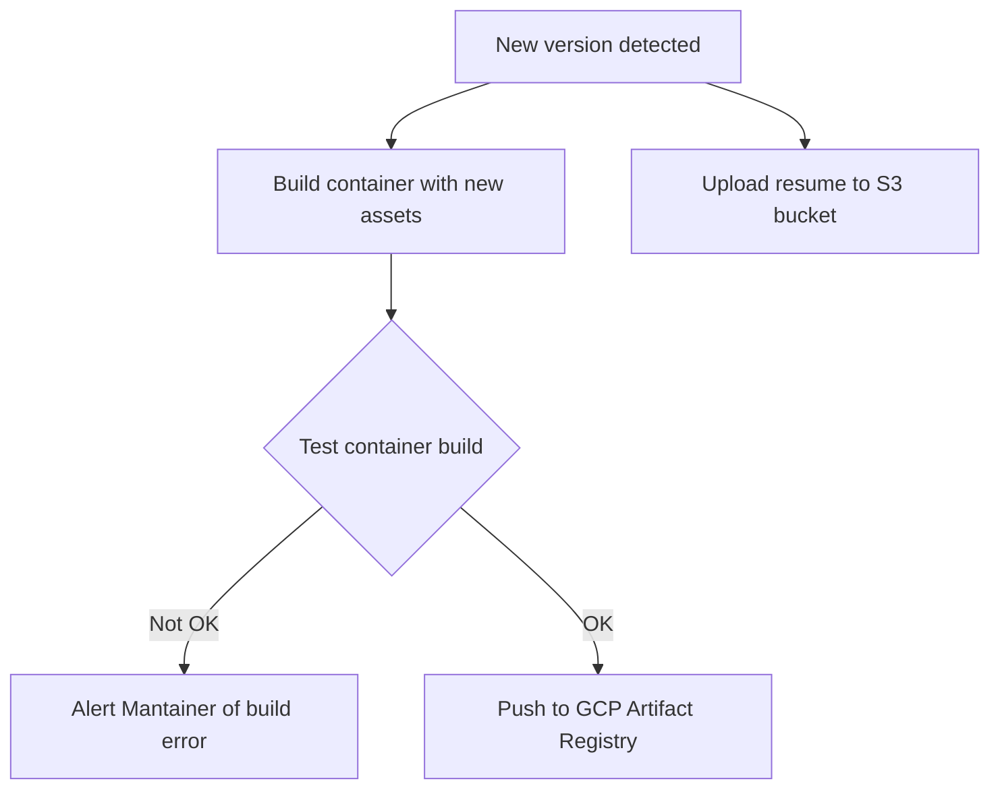

# **Automation of content updates via GitHub Actions**

For updating the content of the Resume Challenge service, I've opted to use GitHub Actions to automate the following:

1. Rebuild container image with updated html files upon modifications. Successful builds result in an upload of the new image to GCP Artifact Registry. For authentication to Google Cloud, Workload Identity Federation was set up using the instructions [here](https://github.com/marketplace/actions/authenticate-to-google-cloud#setup). The main benefit of this is that you don't have to keep on GitHub a potentially long lived Service Account .json key.

2. Upload of resume pdf file to proper AWS S3 bucket.